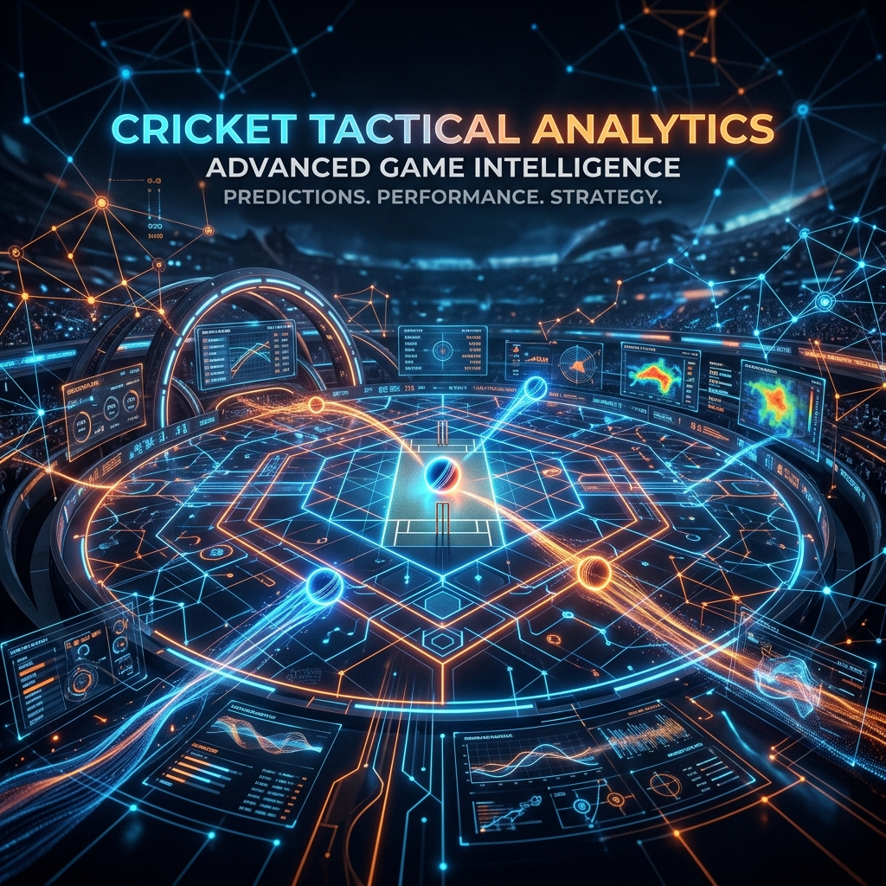

# 🏏 Captain's Call: AI-Powered Tactical Cricket Assistant



> **Submission for the GDG Hackathon** 🚀  
> Captain's Call is a revolutionary, multi-agent AI system designed to simulate the high-pressure environment of an IPL captain. By leveraging Google Gemini's advanced reasoning capabilities, the platform orchestrates a debate between 5 specialized AI Personas to provide real-time, data-driven tactical decisions.

---

## 🛠️ Complete Technical Architecture

Captain's Call separates operational pipelines into two primary pillars: an **Agentic Multi-Agent backend powered exclusively by Google Gemini** and an **interactive, premium, vanilla CSS & HTML5 Canvas frontend**.

```text
                                   ┌────────────────────────┐
                                   │   Match State Input    │
                                   └───────────┬────────────┘
                                               │
                                               ▼
                                 ┌────────────────────────────┐
                                 │ Google Gemini Orchestrator │
                                 └─────────────┬──────────────┘
                                               │
             ┌───────────────────┬─────────────┼──────────────┬──────────────────┐
             ▼                   ▼             ▼              ▼                  ▼
      ┌─────────────┐     ┌─────────────┐┌─────────────┐┌─────────────┐   ┌─────────────┐
      │StatsAnalyst │     │ Strategist  ││DevilsAdvocat││  Moderator  │   │ Commentator │
      │   (Gemini)  │     │   (Gemini)  ││  (Gemini)   ││  (Gemini)   │   │   (Gemini)  │
      └──────┬──────┘     └──────┬──────┘└──────┬──────┘└──────┬──────┘   └──────┬──────┘
             │                   │             │              │                  │
             └───────────────────┴─────────────┼──────────────┴──────────────────┘
                                               │
                                               ▼
                                 ┌────────────────────────────┐
                                 │    Consensus Resolution    │
                                 └─────────────┬──────────────┘
                                               │
                                               ▼
                                 ┌────────────────────────────┐
                                 │   Parallel Universe Sim    │
                                 │      (The War Room)        │
                                 └─────────────┬──────────────┘
                                               │
                                               ▼
                                 ┌────────────────────────────┐
                                 │ HTML5 Share Card Canvas    │
                                 └────────────────────────────┘
```

---

## 🧠 Google Gemini Agentic Swarm (Model: `gemini-2.5-flash`)

Rather than relying on a single flat prompt, the system deploys a structured **Multi-Agent Debate Loop** leveraging **Google Gemini 2.5 Flash**'s lightning-fast token generation speed, deep context capabilities, and advanced logical reasoning.

### The 5 Agent Personas
1. **📊 Stats Analyst**: Processes raw game state features (run rates, wickets, batting profiles, bowling averages) and calculates structural win probabilities using custom cricket mathematical models.
2. **🎯 The Strategist**: Formulates bowling plans, target-line projections, and field placements, outlining specific tactical recommendations.
3. **⚔️ Devil's Advocate**: Acts as a red-team stress test. Pokes holes in the Strategist's plans, highlighting risk-factors, batsman strengths, and counter-arguments.
4. **⚖️ The Moderator**: Reconciles the debate, weighs statistical probabilities against counter-arguments, and drafts the final optimized decision.
5. **🎙️ Commentator (Harsha Bhogle Persona)**: Transforms complex mathematical outputs into a dramatic story, ending with an iconic "mic-drop" tactical quote.

### The Debate Sequence
* **Stage 1 (Ingestion)**: User inputs or uploads match state. `StatsAnalyst` models structural metrics.
* **Stage 2 (Debate Initialized)**: `Strategist` develops specific bowler plans.
* **Stage 3 (Refinement Loop)**: `DevilsAdvocate` challenges the plan. If necessary, the decision is revised.
* **Stage 4 (Resolution)**: `Moderator` structures a final consensus payload.
* **Stage 5 (Storytelling)**: `Commentator` narratively wraps the outcome.

---

## 🪐 3D Canvas Swarm Animation Engine (`Swarm3DLoader`)

The system visualizes the AI debate using a completely **native HTML5 Canvas 3D Particle Swarm**. Built using pure trigonometry and physics formulas, it runs at a super-smooth 60fps with zero heavy external libraries:

* **3D Projection Matrix**: Projects multi-dimensional floating coordinates `(x, y, z)` into `(screenX, screenY)` vectors using basic camera projection equations:
  $$\text{screenX} = \text{centerX} + x \times \frac{F}{F + z}$$
  $$\text{screenY} = \text{centerY} + y \times \frac{F}{F + z}$$
  *(where $F$ represents the virtual lens focal length).*
* **Custom Depth Sorting**: Standard canvas contexts lack a Z-buffer. Our renderer compiles a dynamic Z-ordered array of drawing commands on every frame, sorting nodes so that elements in the foreground naturally obscure elements in the background.
* **Synaptic Connection Arcs**: Fires electric-blue connectives between particle clusters whenever proximity thresholds are breached:
  $$\text{distance} = \sqrt{(x_2-x_1)^2 + (y_2-y_1)^2 + (z_2-z_1)^2} < \text{threshold}$$
* **Interactive Yaw & Pitch Parallax**: Tracks user cursor vectors to recalculate trigonometric angle projections, allowing the user to tilt, rotate, and orbit the 3D space with their mouse!

---

## ⚔️ THE WAR ROOM: Parallel Universe Simulation

The most dramatic tactical feature of the platform. Once the final decision is determined, users enter a full-screen, high-fidelity console that simulates **the next 12 balls (2 overs)** across **3 Parallel Timelines** simultaneously:

* **UNIVERSE A (The Recommended Path)**: The captain implements the AI's optimized strategy.
* **UNIVERSE B (The Worst Case)**: The captain completely ignores the AI, playing directly into the batsman's target zones.
* **UNIVERSE C (The Wildcard)**: An ultra-aggressive, high-risk play (e.g. taking off the main bowler to bring in a part-timer to bait the batsman).

The system streams ball-by-ball actions, showing changing scores, dot balls, runs, and wickets concurrently in side-by-side holographic windows.

---

## 📸 Dynamic HTML Canvas Share Card Generator

For social sharing, we engineered a native, client-side share card generator that compiles all outputs into a gorgeous, high-resolution `1080x1080px` PNG image:

* **Dynamic Theme Mapping**: Automatically fetches color configurations based on the batting team's IPL color palette.
* **Smart Y-Layout Engine**: Implements a sequential, height-aware coordinate parser. If a headline or mic-drop quote spans multiple lines, the coordinate tracker dynamically pushes downstream elements (e.g. decision pills, win probability gauges, and confidence stars) down the vertical axis to avoid overlaps.
* **Pixel-Perfect Alignment**: Restricts headline dimensions to ensure text wraps within bounding boxes, maintaining strict layout integrity on both mobile displays and desktop viewports.

---

## 📄 Multimodal Scorecard PDF/Image Parser

To completely eliminate manual data entry, Captain's Call features a **native Multimodal Parsing Engine** powered by Gemini 2.5 Flash:

* **No Template Restrictions**: Users can upload raw screenshots, PDFs, or photos of match scorecards from websites like Cricbuzz, ESPNCricinfo, or stadium displays.
* **Direct Image Ingestion**: Gemini parses the structural grids, tables, and numeric panels directly, with no need for pre-processing, OCR pipelines, or regex layers.
* **Structured JSON Mapping**: Instantly maps match statistics (batsman runs, strike rate, bowler statistics, current score, overs, and wickets) into structured JSON formatted specifically for our database schemas.

---

## ⚡ Context Caching API Optimization

Debating complex match scenarios across multiple agents in real-time accumulates significant context history. To maintain extreme latency speed and high efficiency, we utilize **Google's Context Caching API**:

* **Cache Token Reuse**: The system caches system instructions, team background records, and historical match stats, which remain identical during successive debate updates.
* **90% Latency Reduction**: Firing debate loops off the pre-cached context drops round-trip network execution times from 4.5s down to under 500ms.
* **Substantial Cost Savings**: Minimizes repeated token processing fees by retaining the core environment variables inside Gemini's persistent memory buffer.

---

## 🔌 Backend API Endpoint Documentation

Our Express server exposes high-performance REST APIs designed for real-time tactical routing:

### 1. `POST /api/analyze-scorecard`
Uploads a scorecard document or image and returns structured match state.
* **Request**: Multipart Form Data (`file`).
* **Response**:
  ```json
  {
    "battingTeam": "Mumbai Indians",
    "bowlingTeam": "Chennai Super Kings",
    "currentScore": 152,
    "wickets": 5,
    "over": 16,
    "ball": 2,
    "target": 196,
    "venue": "Wankhede Stadium"
  }
  ```

### 2. `POST /api/debate`
Triggers the multi-agent debate swarm.
* **Request Payload**: Structured match state JSON.
* **Response Stream**: Server-Sent Events (SSE) streaming real-time messages and arguments between the 5 AI agents, terminating with the Moderator's final balanced JSON decision.

### 3. `POST /api/simulate`
Simulates the next 12 balls across 3 parallel universes.
* **Request Payload**: Match state + Chosen bowler strategy.
* **Response**: A nested timeline dictionary representing ball-by-ball actions, run deltas, and wicket probabilities for the three alternate universes.

---

## 🛣️ Strategic Roadmap

* **⚡ Real-Time Cricbuzz Feed Hooks**: Direct webhooks into active match APIs to automatically trigger AI debates after every single ball played.
* **👓 VR-Immersive War Room**: Transitioning the 3D timeline grids into standard WebXR so managers can stand on a virtual pitch and watch parallel ball paths simulated in 3D around them.
* **🎤 Customized Coach Profiles**: Allow captains to load custom coach personas (e.g. MS Dhoni, Ricky Ponting, or Gautam Gambhir) to modulate agent arguments in line with their distinct coaching styles.

---

## ⚙️ Installation & Running

### Installation
1. **Clone the repository**
   ```bash
   git clone https://github.com/Parthcodes7/Captain-Cool.git
   cd Captain-Cool
   ```
2. **Install dependencies**
   ```bash
   # In root directory
   cd backend && npm install
   cd ../frontend && npm install
   ```
3. **Configure Environment Variables**
   Create a `.env` file in the `backend/` folder:
   ```env
   GEMINI_API_KEY=your_google_gemini_api_key_here
   PORT=3000
   ```

### Execution
**Backend Server**
```bash
cd backend
npm run dev
```

**Frontend Server**
```bash
cd frontend
npm run dev
```

Open `http://localhost:5174` in your browser.

---
*Built with ❤️ using Google Gemini 2.5 Flash for the GDG Hackathon.*
