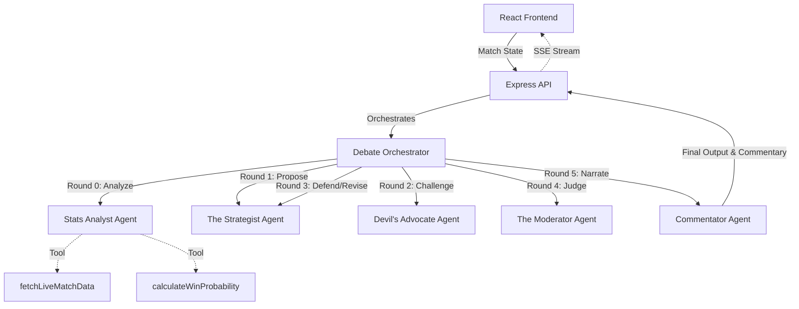

# Captain's Call - Virtual IPL Captain 🏏

An agentic AI application powered entirely by the Google Gemini stack. Built for the GDG Hackathon.

## Architecture

## Agents

1. **Stats Analyst** (Sanjay Manjrekar persona) - Analyzes raw data, calls live match tools.
2. **The Strategist** (MS Dhoni persona) - Proposes the initial tactical move.
3. **Devil's Advocate** (Virat Kohli persona) - Aggressively challenges the strategist's proposal.
4. **The Moderator** (Rohit Sharma persona) - Weighs the arguments and makes the final call.
5. **The Commentator** (Harsha Bhogle persona) - Translates the tactical call into beautiful cricket commentary.

## Tech Stack
- **Frontend**: React 18, Vite, TailwindCSS, Framer Motion
- **Backend**: Node.js, Express, TypeScript, Server-Sent Events (SSE)
- **AI Stack**: Google GenAI SDK (`@google/genai`), Gemini 2.5 Flash, Google ADK

## Setup Instructions

### Prerequisites
- Node.js (v18+)
- Google AI API Key

### Backend Setup
1. `cd backend`
2. `npm install`
3. Copy `.env.example` to `.env` and add your `GOOGLE_AI_API_KEY`. (Get it from [Google AI Studio](https://aistudio.google.com/app/apikey))
4. `npm run dev`

### Frontend Setup
1. `cd frontend`
2. `npm install`
3. `npm run dev`

Open `http://localhost:5173` to view the app!

## The "Over 17 Crisis" Scenario
The app comes pre-loaded with a tense scenario:
- MI chasing 196 against CSK
- 152/5 in 16.2 overs (Required RR: 18.4)
- Hardik Pandya on strike
- CSK has Pathirana, Jadeja, Chahar, and Deshpande as options.

Hit "Make the Call" to watch the agents debate the best course of action!

## Google ADK & Antigravity
This project uses the Google Agent Development Kit for multi-agent orchestration.
Check the `.antigravity/` folder for logs of agent traces!

## Links
- [AI Studio Prompts Placeholder](https://aistudio.google.com)
- [Dev.to Blog Placeholder](https://dev.to)
